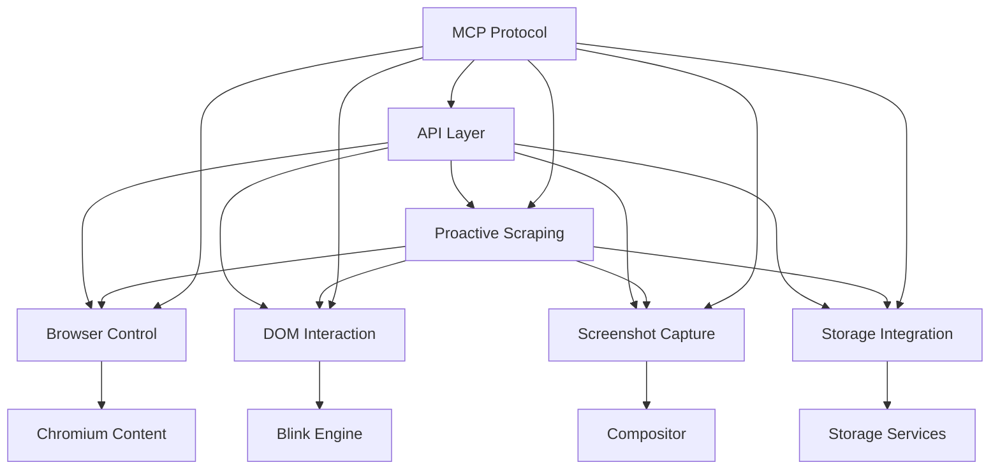

# C++ Playwright Clone - Project Structure

## Overview
This document outlines the modern C++ project structure for implementing a Playwright-like browsing and scraping tool within a Chromium fork, following MCP communication standards and modern C++ best practices.

## Directory Structure

```
chromium-playwright/
├── CMakeLists.txt                 # Root CMake configuration
├── README.md                      # Project documentation
├── LICENSE                        # License file
├── .gitignore                     # Git ignore rules
├── .clang-format                  # Code formatting rules
├── .clang-tidy                    # Static analysis configuration
├── 
├── include/                       # Public headers
│   └── chromium_playwright/
│       ├── browser_control.h
│       ├── dom_interaction.h
│       ├── screenshot_capture.h
│       ├── proactive_scraping.h
│       ├── storage_integration.h
│       ├── api_layer.h
│       └── mcp/                   # MCP communication interfaces
│           ├── mcp_client.h
│           ├── mcp_server.h
│           └── mcp_protocol.h
│
├── src/                          # Source implementation
│   ├── browser_control/
│   │   ├── browser_control_impl.cpp
│   │   ├── browser_context_impl.cpp
│   │   └── page_impl.cpp
│   ├── dom_interaction/
│   │   ├── locator_impl.cpp
│   │   ├── element_handle_impl.cpp
│   │   └── dom_agent.cpp
│   ├── screenshot_capture/
│   │   ├── screenshot_capture_impl.cpp
│   │   └── image_processor.cpp
│   ├── proactive_scraping/
│   │   ├── scraper_impl.cpp
│   │   ├── traversal_engine.cpp
│   │   └── change_detector.cpp
│   ├── storage_integration/
│   │   ├── storage_manager_impl.cpp
│   │   ├── sqlite_storage.cpp
│   │   └── indexeddb_storage.cpp
│   ├── api_layer/
│   │   ├── api_layer_impl.cpp
│   │   └── mojo_interfaces.cpp
│   └── mcp/                      # MCP communication implementation
│       ├── mcp_client_impl.cpp
│       ├── mcp_server_impl.cpp
│       └── mcp_protocol_impl.cpp
│
├── third_party/                  # External dependencies
│   ├── googletest/               # Google Test framework
│   ├── benchmark/                # Google Benchmark
│   └── nlohmann_json/            # JSON library
│
├── tests/                        # Test files
│   ├── unit/                     # Unit tests
│   │   ├── browser_control_test.cpp
│   │   ├── dom_interaction_test.cpp
│   │   ├── screenshot_capture_test.cpp
│   │   ├── proactive_scraping_test.cpp
│   │   ├── storage_integration_test.cpp
│   │   └── api_layer_test.cpp
│   ├── integration/              # Integration tests
│   │   ├── end_to_end_test.cpp
│   │   └── mcp_communication_test.cpp
│   └── fixtures/                 # Test fixtures and data
│       ├── test_pages/
│       └── sample_data/
│
├── examples/                     # Usage examples
│   ├── basic_usage.cpp
│   ├── advanced_scraping.cpp
│   └── mcp_integration.cpp
│
├── docs/                         # Documentation
│   ├── api_reference.md
│   ├── mcp_protocol.md
│   ├── integration_guide.md
│   └── performance_guide.md
│
├── scripts/                      # Build and utility scripts
│   ├── build.sh
│   ├── test.sh
│   ├── format.sh
│   └── setup_dependencies.sh
│
└── tools/                        # Development tools
    ├── code_generator.py
    ├── mcp_validator.py
    └── performance_profiler.py
```

## Key Design Principles

### 1. Modern C++ Standards
- **C++20** minimum standard for modern features
- **RAII** (Resource Acquisition Is Initialization) for memory management
- **Smart pointers** (`std::unique_ptr`, `std::shared_ptr`) for automatic memory management
- **Move semantics** for efficient object transfers
- **Concepts** for template constraints and better error messages
- **Coroutines** for asynchronous operations (C++20)

### 2. MCP Communication Standards
- **Message-based communication** between modules
- **Asynchronous message passing** using modern C++ futures and promises
- **Type-safe message definitions** using structured data
- **Error handling** with standardized error codes and messages
- **Versioning** for protocol evolution
- **Serialization** using modern JSON libraries

### 3. Chromium Integration
- **Mojo IPC** for cross-process communication
- **Chromium's base library** for utilities and threading
- **Blink rendering engine** integration for DOM manipulation
- **Content module** integration for browser control
- **Storage services** integration for data persistence

### 4. Testing and Quality
- **Google Test** for unit testing
- **Google Benchmark** for performance testing
- **Clang-tidy** for static analysis
- **Clang-format** for code formatting
- **Coverage reporting** for test completeness
- **Memory sanitizers** for debugging

### 5. Build System
- **CMake 3.20+** for modern build configuration
- **FetchContent** for dependency management
- **Cross-platform** support (Windows, Linux, macOS)
- **Ninja generator** for fast builds
- **Conan** or **vcpkg** for package management

## Module Dependencies



## Next Steps

1. **Initialize CMake project** with proper C++20 configuration
2. **Set up MCP protocol definitions** for inter-module communication
3. **Implement core interfaces** following the specifications
4. **Create mock implementations** for testing
5. **Integrate with Chromium** build system
6. **Add comprehensive testing** suite
7. **Document APIs** and usage patterns
